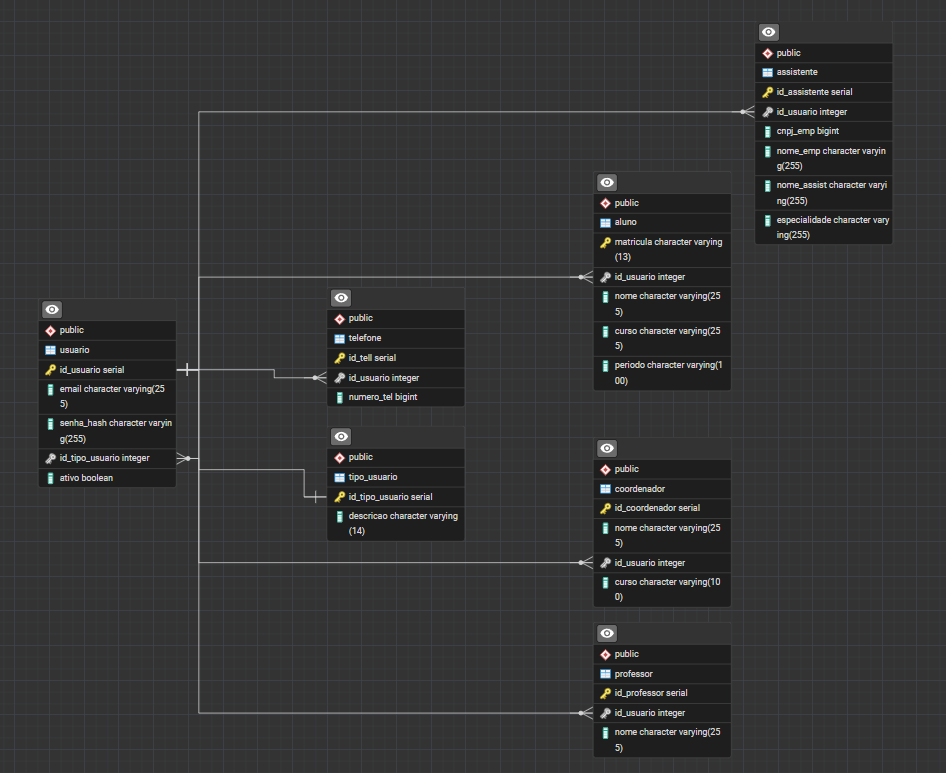

# Sistema de Apoio ao PAEE (Plataforma Digital de Inclusão)

Plataforma web desenvolvida no âmbito do Projeto Interdisciplinar da FATEC Indaiatuba para digitalizar, organizar e otimizar o fluxo de processamento e acompanhamento dos Planos de Atendimento Educacional Especializado (PAEE) para estudantes com deficiência (PcD).

## Sobre o Projeto

O sistema substitui o modelo tradicional e manual baseado em formulários de papel e assinaturas presenciais. O objetivo principal é atuar na orquestração do fluxo de trabalho interno, controlando preenchimentos distribuídos por docentes, validações por parte da coordenação e a geração automatizada do documento final em formato PDF para encaminhamento institucional.

## Atores e Perfis do Sistema

* **Coordenador**: Vincular disciplinas e professores, revisar as seções preenchidas, realizar a validação digital e consolidar o PAEE.
* **Professores**: Responsáveis por preencher de forma restrita e isolada as seções correspondentes às suas respectivas disciplinas.
* **Assistentes de Apoio (AME)**: Realizam os registros de acompanhamento dos alunos por meio de interfaces ágeis com filtros dinâmicos e caixas de seleção.
* **Direção**: Pelo encaminhamento formal da solicitação consolidada para as instâncias externas.
* **Aluno**: Responsável por abrir os processos e enviar informações e documentos sobre a situação do mesmo.

## Arquitetura e Estrutura do Repositório

Futuramente definiremos.

## Requisitos e Regras Principais

* **Fluxo Sem Papel (Zero Híbrido)**: A ferramenta foi concebida para substituir definitivamente o uso de fichas impressas, eliminando a sobrecarga de redigitação e o consumo de insumos materiais.
* **Segurança e Rastreabilidade**: Controle estrito de acesso baseado em papéis (RBAC) e registro de auditoria (timestamp) para aprovações e assinaturas digitais.
* **Filtros Dinâmicos**: Exibição inteligente de formulários segmentados de acordo com a especificidade e o tipo de deficiência do aluno cadastrado.

## Como Executar o Projeto

Futuramente definiremos.

## DER do banco de dados

## Tabelas e campos

**usuario:**
id_usuario PK
email
senha_hash
id_tipo_usuario FK
ativo

**tipo_usuario:**
id_tipo_usuario PK
descricao

**aluno:**
matricula PK
id_usuario FK
nome
curso
periodo

**professor:**
id_professor PK
id_usuario FK
nome

**assistente:**
id_assistente PK
id_usuario FK
cnpj_emp
nome_emp
nome_assist
especialidade

**coordenador:**
id_coordenador PK
nome
id_usuario FK
curso

**telefone:**
id_tel PK
id_usuario FK
numero_tel